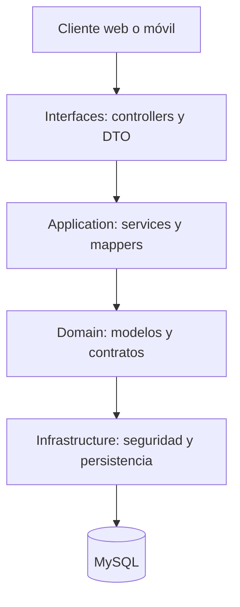

# Sistema de Orientación Vocacional — Backend API

API REST del Sistema de Orientación Vocacional de la Universidad de San Buenaventura. El backend centraliza la autenticación, la administración de usuarios y catálogos, la presentación de la prueba vocacional, el cálculo de afinidades y los indicadores administrativos consumidos por las aplicaciones web y móvil.

## Contenido

- [Estado funcional](#estado-funcional)
- [Tecnologías](#tecnologías)
- [Arquitectura](#arquitectura)
- [Modelo de datos MySQL](#modelo-de-datos-mysql)
- [Seguridad y autorización](#seguridad-y-autorización)
- [Endpoints REST](#endpoints-rest)
- [Reglas de negocio](#reglas-de-negocio)
- [Configuración local](#configuración-local)
- [Ejecución y pruebas](#ejecución-y-pruebas)
- [Consideraciones actuales](#consideraciones-actuales)

## Estado funcional

El estado se basa en las clases, servicios y rutas presentes en el código fuente actual. “Implementado” significa que existe el flujo en el backend; la validación integral también depende de que MySQL contenga el esquema, los catálogos y la matriz de permisos esperados.

| Funcionalidad | Estado actual | Ruta o mecanismo principal |
|---|---|---|
| Login con usuario o correo | Implementado | `POST /api/v1/auth/login` |
| Emisión y validación de JWT | Implementado | JWT firmado con HS256 y encabezado `Bearer` |
| Validación de rol y permisos | Implementado | Spring Security, `PermissionFilter`, `rol`, `actividad` y `rol_actividad` |
| Solicitud de recuperación | Implementado | `POST /api/v1/auth/forgot-password` |
| Generación de token de recuperación | Implementado | Token de un solo uso con vigencia de una hora |
| Restablecimiento de contraseña | Implementado | `POST /api/v1/auth/reset-password` |
| Registro de usuario | Implementado | `POST /api/v1/auth/register` |
| Consulta del perfil propio | Implementado | `GET /api/v1/usuarios/me` |
| Edición del perfil propio | Implementado | `PUT /api/v1/usuarios/me/perfil` |
| Cambio de ciudad a municipio | Implementado | DTO `municipio`, tablas `departamentos` y `municipios` |
| Cambio de contraseña autenticado | Implementado | `POST /api/v1/usuarios/me/cambio-password` |
| Eliminación del perfil propio | Implementado mediante desactivación lógica | `DELETE /api/v1/usuarios/me` |
| Carga de preguntas para la prueba | Implementado | `GET /api/v1/preguntas/para-prueba` |
| Presentación de la prueba | Implementado | `POST /api/v1/pruebas` |
| Cálculo y consulta de resultados | Implementado | `POST /api/v1/pruebas` y `GET /api/v1/pruebas/{id}/resultado` |
| Historial de pruebas | Implementado | `GET /api/v1/pruebas/mis-pruebas` y rutas de usuario |
| Administración de áreas, programas y preguntas | Implementado | CRUD con desactivación y reactivación lógica |
| Administración de roles y permisos | Implementado | Rutas de roles, actividades y asignación de actividades |
| Dashboard administrativo | Implementado | `GET /api/v1/dashboard` |
| Auditoría de operaciones | Implementado | Tabla `logs` y `GET /api/v1/admin/logs` |
| Logging completo de endpoints | Implementado | `LogsService` registra login, registro, cambios de contraseña, CRUD admin, pruebas y más |
| Token de recuperación hasheado (SHA-256) | Implementado | `TokenHashService` almacena hash; tokens previos se invalidan automáticamente |
| Restablecimiento de contraseña por ROOT | Implementado | `POST /api/v1/usuarios/{id}/restablecer-contrasena` (usa número de documento) |
| Carga de imagen pacho por área | Implementado | `POST /api/v1/areas/{id}/imagen-pacho` con almacenamiento en disco |

Los elementos que en el README anterior aparecían como “por ajustar” o “faltantes” ya cuentan con implementación en el código actual.

## Tecnologías

| Componente | Tecnología |
|---|---|
| Lenguaje | Kotlin 2.2.21 |
| Plataforma | Java 21 |
| Framework | Spring Boot 4.0.5 |
| API web | Spring Web / Spring MVC |
| Persistencia | Spring Data JPA + Hibernate |
| Base de datos principal | MySQL mediante MySQL Connector/J |
| Seguridad | Spring Security, BCrypt y JWT (JJWT 0.13.0) |
| Validación | Jakarta Bean Validation |
| Correo | Spring Mail |
| Documentación | OpenAPI 3 + Swagger UI mediante springdoc 3.0.0 |
| Construcción | Gradle 9.4.1 con Kotlin DSL |
| Pruebas | JUnit 5 y Spring Boot Test |

Aunque el proyecto conserva dependencias de H2 para desarrollo o pruebas, el perfil local vigente está configurado para trabajar con **MySQL**.

## Arquitectura

El proyecto aplica una arquitectura por capas inspirada en Clean Architecture y DDD ligero. Los controladores no acceden directamente a JPA: los casos de uso pasan por servicios de aplicación y contratos de repositorio definidos en el dominio.



### Estructura principal

```text
src/main/kotlin/com/usbbog/ProyectoVocacional/Backend
├── application
│   ├── dto
│   ├── mapper
│   └── service
├── domain
│   ├── model
│   └── repository
├── infrastructure
│   ├── config
│   ├── mail
│   ├── persistence
│   │   ├── entity
│   │   ├── mapper
│   │   ├── repository
│   │   └── repositoryimpl
│   └── security
└── interfaces
    └── controller
```

### Responsabilidad de las capas

- **Interfaces:** recibe solicitudes HTTP, valida DTO, invoca casos de uso y devuelve JSON.
- **Application:** coordina reglas y operaciones mediante servicios, DTO y mappers.
- **Domain:** contiene los modelos y contratos de repositorio independientes de JPA.
- **Infrastructure:** implementa persistencia MySQL, seguridad JWT/RBAC, configuración, correo y manejo transversal de errores.

## Modelo de datos MySQL

La persistencia actual usa una base MySQL con tablas de catálogo, evaluación, seguridad y ubicación. Las entidades usan identificadores `BIGINT` autoincrementales, excepto los códigos de departamentos y municipios, que son cadenas.

| Módulo | Tabla | Propósito y relaciones principales |
|---|---|---|
| Catálogo | `area` | Define áreas vocacionales. Un área agrupa programas. |
| Catálogo | `programa` | Pertenece a un área y agrupa preguntas. |
| Ubicación | `departamentos` | Catálogo público de departamentos. |
| Ubicación | `municipios` | Cada municipio referencia un departamento. |
| Evaluación | `pregunta` | Pregunta activa asociada a un programa. |
| Evaluación | `prueba` | Aplicación realizada por un usuario; conserva fecha, duración, versión y satisfacción. |
| Evaluación | `afinidad_programa` | Resultado normalizado de una prueba para cada programa evaluado. |
| Evaluación | `reporte` | Guarda el área predominante, los tres programas recomendados y el nombre lógico del reporte. |
| Seguridad | `usuario` | Cuenta, perfil, rol, programa opcional, departamento, municipio y estado. |
| Seguridad | `rol` | Rol del sistema. |
| Seguridad | `actividad` | Permiso definido por método HTTP y patrón de URL. |
| Seguridad | `rol_actividad` | Asociación activa entre roles y actividades. |
| Seguridad | `logs` | Auditoría de acciones, usuario ejecutor, usuario afectado y resultado. |
| Seguridad | `password_reset_token` | Token de recuperación, expiración y marca de uso. |

### Cambios frente al modelo anterior

- MySQL es el gestor de base de datos actual; ya no se documenta PostgreSQL como motor ni se asumen esquemas de PostgreSQL.
- `usuario` almacena `id_departamento` e `id_municipio`; la API expone el campo `municipio` en lugar de `ciudad`.
- No existe una entidad o tabla `respuesta` en el modelo actual. Las respuestas llegan dentro de la solicitud de presentación y se usan para calcular los resultados.
- No existe una entidad o tabla `afinidad_area`. La afinidad por área se obtiene promediando las afinidades de sus programas.
- `reporte` almacena metadatos del resultado: área predominante, top 3 de programas y nombre del archivo.
- Las eliminaciones funcionales usan el campo `estado`; no eliminan físicamente los registros principales.

> La configuración local usa `spring.jpa.hibernate.ddl-auto=validate`. Por lo tanto, Hibernate valida el modelo, pero no crea ni actualiza las tablas. El esquema y los datos iniciales deben existir antes de iniciar la aplicación.

## Seguridad y autorización

### Autenticación

El login acepta el nombre de usuario o el correo en el campo `username`. Si las credenciales son válidas, devuelve un JWT con el nombre de usuario como `sub` y el rol en el claim `rol`.

```http
POST /api/v1/auth/login
Content-Type: application/json

{
  "username": "usuario_o_correo",
  "password": "contraseña"
}
```

Respuesta abreviada:

```json
{
  "token": "<jwt>",
  "type": "Bearer",
  "expiresIn": 10800,
  "username": "usuario",
  "rol": "ROL_ASIGNADO"
}
```

Las rutas protegidas reciben el token así:

```http
Authorization: Bearer <jwt>
```

### Autorización RBAC dinámica

Después de autenticar el JWT, `PermissionFilter` consulta en MySQL las actividades activas asignadas al rol. El acceso se concede cuando coinciden el método HTTP y el patrón de URL almacenados en `actividad`.

Además de esta matriz dinámica, existen restricciones explícitas:

- `ROOT`: CRUD de roles, asignación de actividades, cambio de rol de usuario y consulta de logs.
- `ROOT` o `ADMINISTRADOR`: consulta de las pruebas de cualquier usuario.
- El usuario autenticado puede consultar sus propios datos y resultados cuando su rol tenga registrada la actividad correspondiente.
- La cuenta `ROOT` no puede desactivarse a sí misma.

### Rutas públicas

- `/`
- `/swagger` y recursos de Swagger/OpenAPI
- `/api/v1/auth/**`
- `/api/v1/departamentos/**`
- `/api/v1/catalogos/**`

El resto de las rutas requiere autenticación y permiso activo.

## Endpoints REST

Prefijo general: `/api/v1`.
Formato de intercambio: JSON

### Autenticación y recuperación

| Método | Ruta | Acceso | Descripción |
|---|---|---|---|
| `POST` | `/api/v1/auth/login` | Público | Inicia sesión con usuario o correo y retorna un JWT. |
| `POST` | `/api/v1/auth/register` | Público | Registra un usuario y cifra su contraseña con BCrypt. |
| `POST` | `/api/v1/auth/forgot-password` | Público | Genera un token y envía el enlace de recuperación si el correo existe. |
| `POST` | `/api/v1/auth/reset-password` | Público | Restablece la contraseña con un token vigente y no utilizado. |

### Usuarios y perfil

| Método | Ruta | Acceso | Descripción |
|---|---|---|---|
| `GET` | `/api/v1/usuarios` | Protegido | Lista los usuarios activos. |
| `GET` | `/api/v1/usuarios/{id}` | Protegido | Consulta un usuario activo. |
| `GET` | `/api/v1/usuarios/me` | Protegido | Consulta el perfil autenticado. |
| `PUT` | `/api/v1/usuarios/me/perfil` | Protegido | Actualiza datos editables del perfil. |
| `POST` | `/api/v1/usuarios/me/cambio-password` | Protegido | Cambia la contraseña tras validar la actual. |
| `DELETE` | `/api/v1/usuarios/me` | Protegido | Desactiva la cuenta propia. |
| `GET` | `/api/v1/usuarios/me/pruebas` | Protegido | Consulta las pruebas del usuario autenticado. |
| `DELETE` | `/api/v1/usuarios/{id}` | Protegido | Desactiva un usuario. |
| `PATCH` | `/api/v1/usuarios/{id}/reactivar` | Protegido | Reactiva un usuario. |
| `PATCH` | `/api/v1/usuarios/{id}/rol` | `ROOT` | Cambia el rol de un usuario activo. |
| `POST` | `/api/v1/usuarios/{id}/restablecer-contrasena` | `ROOT` | Restablece la contraseña de un usuario al número de documento. |
| `GET` | `/api/v1/usuarios/{id}/pruebas` | `ROOT` o `ADMINISTRADOR` | Consulta las pruebas de otro usuario. |

### Ubicaciones y catálogos públicos

| Método | Ruta | Acceso | Descripción |
|---|---|---|---|
| `GET` | `/api/v1/departamentos` | Público | Lista departamentos. |
| `GET` | `/api/v1/departamentos/{id}/municipios` | Público | Lista los municipios de un departamento. |
| `GET` | `/api/v1/catalogos/programas` | Público | Devuelve áreas activas con sus programas para formularios. |

### Áreas y programas

| Método | Ruta | Acceso | Descripción |
|---|---|---|---|
| `GET` | `/api/v1/areas` | Protegido | Lista áreas activas. |
| `GET` | `/api/v1/areas/{id}` | Protegido | Consulta un área. |
| `POST` | `/api/v1/areas` | Protegido | Crea un área. |
| `PUT` | `/api/v1/areas/{id}` | Protegido | Actualiza un área activa. |
| `DELETE` | `/api/v1/areas/{id}` | Protegido | Desactiva un área. |
| `PATCH` | `/api/v1/areas/{id}/reactivar` | Protegido | Reactiva un área. |
| `POST` | `/api/v1/areas/{id}/imagen-pacho` | Protegido | Sube la imagen pacho de un área (multipart/form-data). |
| `GET` | `/api/v1/areas/{id}/programas` | Protegido | Lista programas de un área. |
| `GET` | `/api/v1/programas` | Protegido | Lista programas activos. |
| `GET` | `/api/v1/programas/{id}` | Protegido | Consulta un programa. |
| `POST` | `/api/v1/programas` | Protegido | Crea un programa asociado a un área. |
| `PUT` | `/api/v1/programas/{id}` | Protegido | Actualiza un programa activo. |
| `DELETE` | `/api/v1/programas/{id}` | Protegido | Desactiva un programa. |
| `PATCH` | `/api/v1/programas/{id}/reactivar` | Protegido | Reactiva un programa. |
| `GET` | `/api/v1/programas/{id}/preguntas` | Protegido | Lista preguntas de un programa. |

### Preguntas y pruebas

| Método | Ruta | Acceso | Descripción |
|---|---|---|---|
| `GET` | `/api/v1/preguntas` | Protegido | Lista preguntas activas. |
| `GET` | `/api/v1/preguntas/{id}` | Protegido | Consulta una pregunta activa. |
| `GET` | `/api/v1/preguntas/para-prueba` | Protegido | Devuelve preguntas activas aleatorizadas. Acepta `porArea` opcional. |
| `POST` | `/api/v1/preguntas` | Protegido | Crea una pregunta asociada a un programa. |
| `PUT` | `/api/v1/preguntas/{id}` | Protegido | Actualiza una pregunta activa. |
| `DELETE` | `/api/v1/preguntas/{id}` | Protegido | Desactiva una pregunta. |
| `PATCH` | `/api/v1/preguntas/{id}/reactivar` | Protegido | Reactiva una pregunta. |
| `POST` | `/api/v1/pruebas` | Protegido | Presenta una prueba y retorna el resultado calculado. |
| `GET` | `/api/v1/pruebas/{id}` | Propietario, `ROOT` o `ADMINISTRADOR` | Consulta los metadatos de una prueba. |
| `GET` | `/api/v1/pruebas/{id}/resultado` | Propietario, `ROOT` o `ADMINISTRADOR` | Consulta afinidades y recomendaciones. |
| `GET` | `/api/v1/pruebas/mis-pruebas` | Protegido | Lista el historial del usuario autenticado. |

Ejemplo abreviado para presentar la prueba:

```json
{
  "tiempoInvertido": 1320,
  "versionPrueba": "v1",
  "satisfaccion": 5,
  "respuestas": [
    {
      "preguntaId": 1,
      "codigoPregunta": "P001",
      "valor": 4
    }
  ]
}
```

### Roles, permisos y administración

| Método | Ruta | Acceso | Descripción |
|---|---|---|---|
| `GET` | `/api/v1/roles` | `ROOT` | Lista roles activos. |
| `GET` | `/api/v1/roles/{id}` | `ROOT` | Consulta un rol. |
| `POST` | `/api/v1/roles` | `ROOT` | Crea un rol. |
| `PUT` | `/api/v1/roles/{id}` | `ROOT` | Actualiza un rol. |
| `DELETE` | `/api/v1/roles/{id}` | `ROOT` | Desactiva un rol. |
| `PATCH` | `/api/v1/roles/{id}/reactivar` | `ROOT` | Reactiva un rol. |
| `GET` | `/api/v1/roles/{id}/actividades` | Protegido | Lista las actividades asignadas a un rol. |
| `PUT` | `/api/v1/roles/{id}/actividades` | `ROOT` | Reemplaza las actividades asignadas a un rol. |
| `GET` | `/api/v1/actividades` | Protegido | Lista actividades activas. |
| `GET` | `/api/v1/actividades/{id}` | Protegido | Consulta una actividad. |
| `GET` | `/api/v1/dashboard` | Protegido | Devuelve métricas, distribución geográfica y resultados recientes. |
| `GET` | `/api/v1/admin/logs` | `ROOT` | Consulta el registro de auditoría. |

### Logs y auditoría

| Método | Ruta | Acceso | Descripción |
|---|---|---|---|
| `GET` | `/api/v1/logs` | `ROOT` | Lista registros de auditoría con filtros por usuario, acción y fecha. |
| `GET` | `/api/v1/logs/usuario/{id}` | `ROOT` | Lista los registros de auditoría de un usuario específico. |

“Protegido” implica JWT válido y una actividad compatible en la matriz dinámica de permisos.

## Reglas de negocio

### Usuarios

- Documento, correo y nombre de usuario deben ser únicos.
- La contraseña de registro debe tener al menos ocho caracteres y se almacena con BCrypt.
- El registro asigna actualmente el rol con identificador `3`; dicho rol debe existir en los datos iniciales.
- El programa es opcional, pero debe existir si se envía.
- La edición del perfil permite modificar nombre, apellidos, teléfono, género, departamento, municipio, programa y semestre; no modifica documento, correo ni nombre de usuario.
- El cambio de contraseña exige la contraseña actual y que la nueva sea diferente.
- Eliminar una cuenta cambia su estado a inactivo. No se elimina físicamente.

### Recuperación de contraseña

- La respuesta de `forgot-password` es genérica para no revelar si un correo está registrado.
- Cada token se genera de forma aleatoria, vence una hora después de su creación y solo puede utilizarse una vez.
- Los tokens se almacenan como hash SHA-256 en la tabla `password_reset_token`; el token raw nunca se persiste.
- Al solicitar un nuevo token, los tokens anteriores no utilizados del mismo usuario se invalidan automáticamente.
- El enlace se construye con `app.frontend-url` y `app.reset-password-path`.
- Tras un restablecimiento exitoso, la nueva contraseña se cifra y el token queda marcado como usado.
- **ROOT** puede restablecer la contraseña de cualquier usuario mediante `POST /usuarios/{id}/restablecer-contrasena`; el nuevo valor es el número de documento del usuario.

### Presentación y cálculo de la prueba

- Las respuestas aceptan valores enteros entre `1` y `4`; la satisfacción opcional acepta valores entre `1` y `5`.
- Cada respuesta debe referenciar una pregunta activa, incluir su código correcto y no repetir el identificador de pregunta.
- Al presentar una nueva prueba se desactiva la prueba activa anterior del mismo usuario.
- La afinidad por programa se normaliza a una escala de `0` a `100`:

  `afinidad = round(((Σ valores - n) / (3 × n)) × 100)`

- La afinidad de un área es el promedio de las afinidades de sus programas evaluados.
- En caso de empate entre áreas, se prioriza el mejor programa individual y luego el menor identificador de área.
- El resultado devuelve todas las áreas activas, el área predominante y los tres programas con mayor afinidad.
- El acceso a una prueba o resultado se limita a su propietario, salvo para los roles `ROOT` y `ADMINISTRADOR`.
- El backend exige al menos una respuesta, pero no fija un número total de preguntas. El conjunto se obtiene del catálogo activo.

### Desactivación lógica y auditoría

- Usuarios, roles, áreas, programas y preguntas se desactivan mediante su campo `estado` y pueden reactivarse por las rutas correspondientes.
- Las áreas, programas y preguntas también soportan inclusión/exclusión con el campo `activo` para control granular.
- Las operaciones relevantes generan registros de auditoría con el usuario ejecutor, el recurso afectado, una descripción y el resultado.
- El logging registra login, registro, cambio de contraseña, restablecimiento, CRUD administrativo, pruebas, roles, permisos y carga de imágenes.

## Configuración local

### Requisitos

- JDK 21.
- MySQL con el modelo y los datos iniciales cargados.
- Acceso a un servidor SMTP si se desea enviar correos de recuperación.
- El repositorio incluye Gradle Wrapper; no es necesario instalar Gradle globalmente.

El perfil activo se define en `src/main/resources/application.properties`:

```properties
spring.profiles.active=local
app.frontend-url=http://localhost:5173
app.reset-password-path=/reset-password
```

Cree o complete `src/main/resources/application-local.properties`. Este archivo está ignorado por Git y no debe contener credenciales reales en documentación ni commits.

```properties
spring.application.name=ProyectoVocacional
server.port=8088

spring.datasource.url=jdbc:mysql://localhost:3306/orientacion_vocacional?useSSL=false&serverTimezone=UTC
spring.datasource.username=<usuario_mysql>
spring.datasource.password=<contraseña_mysql>
spring.datasource.driver-class-name=com.mysql.cj.jdbc.Driver

spring.jpa.database-platform=org.hibernate.dialect.MySQLDialect
spring.jpa.hibernate.ddl-auto=validate
spring.jpa.show-sql=false

jwt.secret=<secreto_hs256_de_al_menos_32_bytes>
jwt.expiration=10800000

spring.mail.host=smtp.example.com
spring.mail.port=587
spring.mail.username=<usuario_smtp>
spring.mail.password=<contraseña_smtp>
spring.mail.properties.mail.smtp.auth=true
spring.mail.properties.mail.smtp.starttls.enable=true

springdoc.swagger-ui.path=/swagger
```

La configuración CORS incluida permite por defecto los orígenes locales `http://localhost:5173`, `http://127.0.0.1:5173` y `http://localhost:4173`. Agregue los dominios de despliegue antes de publicar el servicio.

## Ejecución y pruebas

En Linux o macOS:

```bash
./gradlew bootRun
```

En Windows:

```powershell
./gradlew.bat bootRun
```

Con el puerto local predeterminado:

- API: `http://localhost:8088`
- Swagger UI: `http://localhost:8088/swagger`
- Especificación OpenAPI: `http://localhost:8088/v3/api-docs`

Para ejecutar la suite de pruebas:

```bash
./gradlew test
```

El repositorio contiene actualmente una prueba básica de carga del contexto de Spring. Se recomienda ampliar la cobertura con pruebas unitarias de servicios y pruebas de integración de seguridad, persistencia y endpoints.

### Formato de errores

Los errores controlados se devuelven con una estructura común:

```json
{
  "timestamp": "2026-08-15T10:30:00",
  "status": 400,
  "error": "BAD_REQUEST",
  "message": "Descripción del error",
  "path": "/api/v1/recurso"
}
```

Estados habituales: `400` para validaciones, `401` para falta de autenticación, `403` para falta de permisos, `404` para recursos inexistentes y `409` para conflictos de integridad.

## Consideraciones actuales

- El resultado incluye la URL `/api/v1/pruebas/{id}/reporte`, pero el controlador actual todavía no expone una ruta para generar o descargar el archivo del reporte.
- Existen DTO de refresh token en el proyecto, pero `AuthController` aún no publica un endpoint de renovación de JWT.
- El registro depende temporalmente del rol con identificador `3`; conviene reemplazar esta dependencia por una búsqueda por nombre o una propiedad configurable.
- No hay scripts de migración versionados en el repositorio. Debido a `ddl-auto=validate`, el despliegue debe aprovisionar el esquema MySQL por otro medio.
- La matriz de `actividad` y `rol_actividad` debe estar cargada y alineada con los métodos y patrones de URL; de lo contrario, una ruta autenticada responderá `403`.
- El logging registra operaciones en 29+ puntos del sistema: login, registro, perfil, contraseles, CRUD administrativo, pruebas, roles y pacho.
- Las imágenes pacho se almacenan en disco bajo `src/main/resources/static/images/pacho/` y se sirven estáticamente.
